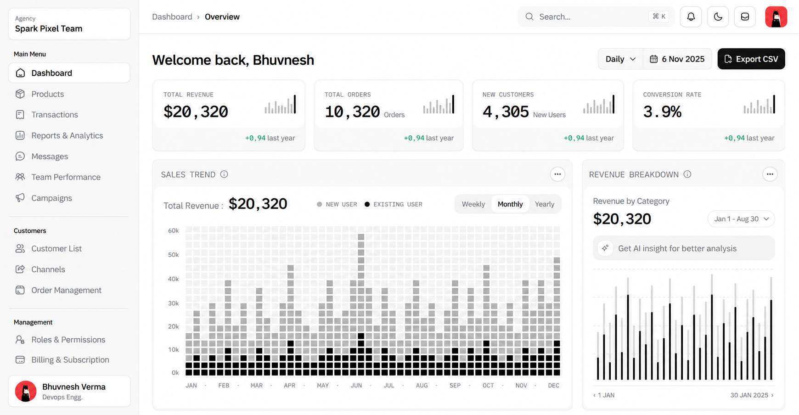
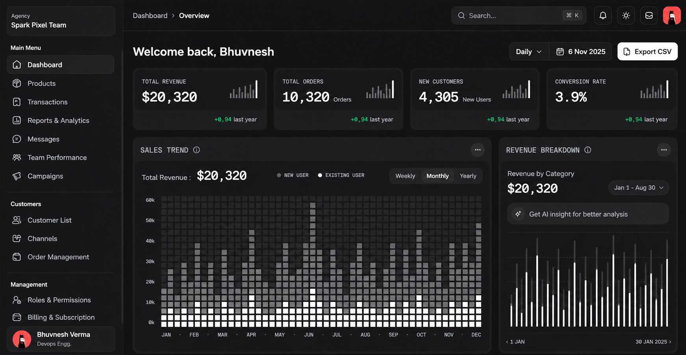

# hms-ai

Hospital Management System with AI-ready modules. Monorepo: `website/` holds the staff dashboard (Next.js), `patient-app/` will hold the patient side later.

## Layout

```text
website/          # staff dashboard (Next.js 16 App Router)
  app/            # routes (dashboard, patients, billing, AI chat API, etc.)
  components/     # dashboard shell, tables, dialogs, AI assistant
  data/           # seed data (mock hospital dataset)
  docs/           # DESIGN.md and style-docs/ UI pattern notes
  lib/            # permissions, AI tools, repositories, utils
  public/         # static assets
patient-app/      # planned patient application (not created yet)
.github/          # readme and assets
ROHIT.AGENT.md    # handoff doc (open PR #1)
```

## Screenshots

### Light mode



### Dark mode



## Getting Started

Requirements: Node.js 20+, npm.

```bash
cd website
npm install
npx next dev --port 3000
```

Open http://localhost:3000.

## Scripts (run inside `website/`)

```bash
npm run dev     # start dev server
npm run build   # production build
npm run start   # run production build
npm run lint    # run eslint
```

Use `npx next dev --port 3000` directly. `npm run dev -- --port 3000` fails on Windows npm flag parsing.

## Tech Stack

- Next.js 16 (App Router)
- React 19
- TypeScript 5
- Tailwind CSS 4
- shadcn UI on Radix UI primitives
- Recharts 3 for charts
- HugeIcons for icons
- OpenAI SDK against NVIDIA NIM (OpenAI-compatible) for the staff AI assistant
- Zod-validated, role-gated AI tools over a repository boundary

## Conventions

- No emojis unless requested.
- No em dash. Use hyphen (-) or comma.
- Commits follow Conventional Commits, for example `feat(team): add member search`.
